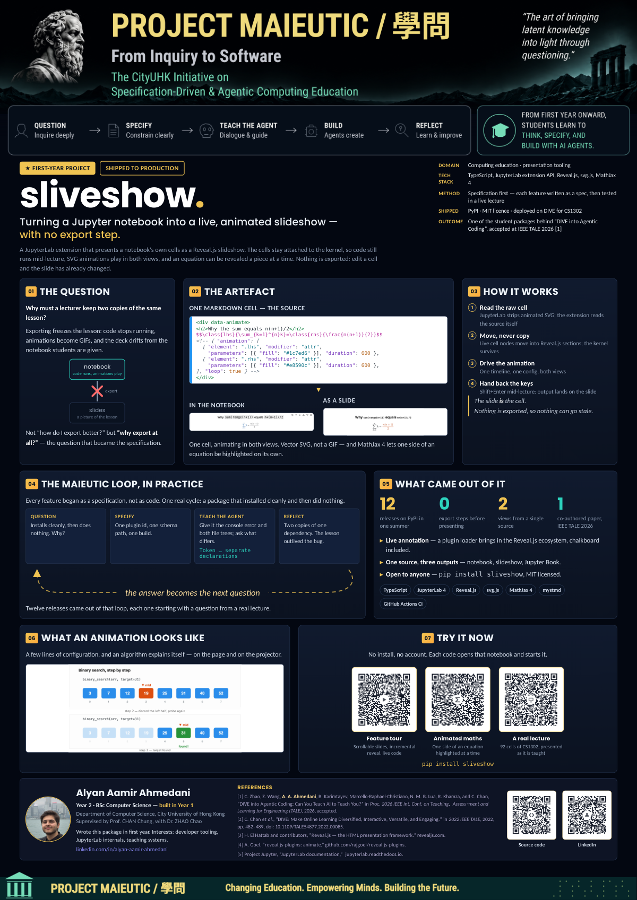
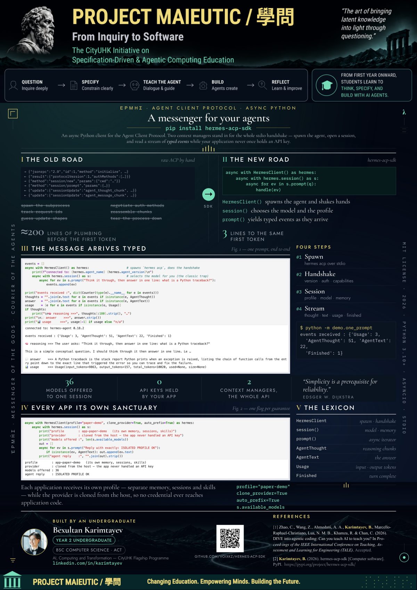
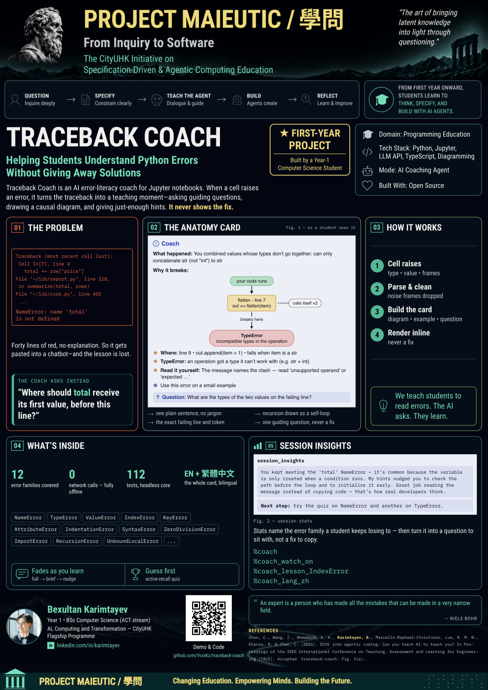
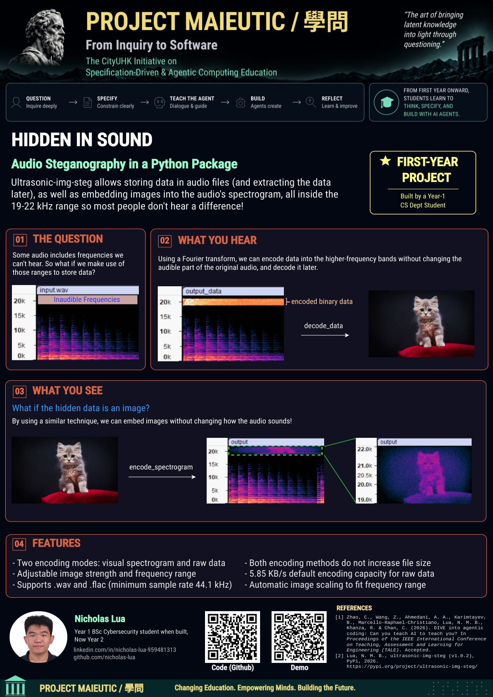
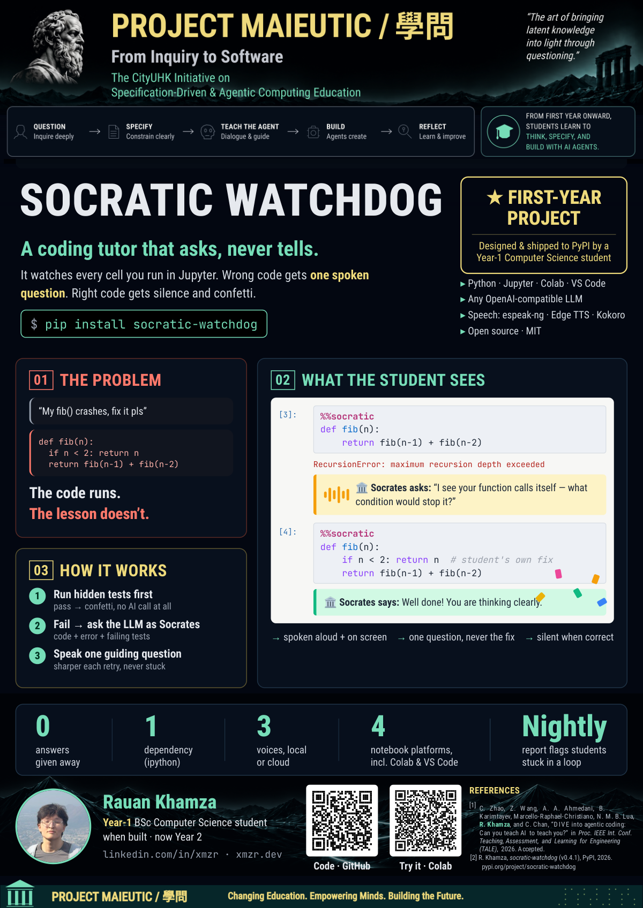

**Project Maieutic** is the CityUHK Initiative on *Specification-Driven & Agentic Computing Education*. **Maieutics** — from the Greek for *midwifery* — is the art of bringing latent knowledge into light through Socratic questioning. In Agentic Coding, it means prompting the AI with appropriate specifications to build highly reusable software packages. More broadly, Socratic questioning encourages us to use AI to teach us to think, rather than to replace our thinking. The name is carried by the Chinese word for knowledge, 學問, which splits into 學 (learning) and 問 (asking) — and can also be read as *learning to ask*.

## The Platforms

The initiative is continuously developed — built and extended by students and staff.

- **DIVE — Learn + Build** — One AI-enhanced workspace for programming, live course materials, and shared CPU/GPU resources. Out of the box, no complex setup. The self-learning Hermes agent helps you learn and summarizes skills for you. You can *inspect, adapt, and extend how the coding agent works* — from prompts and tools to context and control, not just use it. ([github.com/dive4dec/jupyter](https://github.com/dive4dec/jupyter))
- **E-Quiz — Assessment + Management** — A self-contained, programmable online exam system (improved on Moodle) where the teacher is the administrator with full control over course data and tools. AI-powered analytics analyze students' submission histories across attempts to surface common coding mistakes; the integrated Hermes Agent lets teachers run complex analyses quickly. ([github.com/dive4dec/e-quiz](https://github.com/dive4dec/e-quiz))
- **Debugger — AI-Assisted Visual Debugger** — Python/C++ that executes *locally in the browser*, scaling to large exam cohorts. It gives **hints, not answers**, with step-by-step visualization — keeping the lesson with the student.
- **AI-Ready Knowledge Base** — This Obsidian Vault: an AI-ready knowledge base that is *structured, connected, and clear* — built with AI and ready for AI to use.
- **DeepSeek Harness (`dsh`)** — Newly released and already integrated. The Node launcher + agent runtime that powers DIVE's coding agent — the layer you shape. (See the [[Deepseek Harness MOC|Deepseek Harness]] area.)

:::{card}
:header: Project Maieutic — The Platforms
<video src="https://github.com/dive4dec/obsidian-vault/releases/download/videos_v1/Project_Maieutic_platforms_downloaded_from_ytb_emDBgB4MEHs.mp4" controls preload="metadata" style="width:100%"></video>
:::

## Student First-Year Projects

Each package below was specified, built, and shipped to PyPI by a first-year undergraduate using AI to turn an idea into a working, open-source tool.

::::{card}
:header: [`sliveshow`](https://github.com/AlyanAamirAhmedani/sliveshow)[^sliveshow]
:::{twocol}
:::{column}
<video src="https://github.com/dive4dec/obsidian-vault/releases/download/videos_v1/sliveshow_ytb_sqLCVXU2Ld4.mp4" controls preload="metadata"></video>
:::
:::{column}

:::
:::
::::

::::{card}
:header: [`hermes-acp-sdk`](https://github.com/VoixKz/hermes-acp-sdk)[^hermes-acp-sdk]
:::{twocol}
:::{column}
<video src="https://github.com/dive4dec/obsidian-vault/releases/download/videos_v1/hermes_acp_sdk_1080P_downloaded_from_ytb_VhVRph4tv_4.mp4" controls preload="metadata"></video>
:::
:::{column}

:::
:::
::::

::::{card}
:header: [`traceback-coach`](https://github.com/VoixKz/traceback-coach)[^traceback-coach]
:::{twocol}
:::{column}
<video src="https://github.com/dive4dec/obsidian-vault/releases/download/videos_v1/traceback_coach_1080P_downloaded_from_ytb_XSCAI8eRU7M.mp4" controls preload="metadata"></video>
:::
:::{column}

:::
:::
::::

::::{card}
:header: [`ultrasonic-img-steg`](https://github.com/nicholas-lua/ultrasonic-img-steg)[^ultrasonic-img-steg]
:::{twocol}
:::{column}
<video src="https://github.com/dive4dec/obsidian-vault/releases/download/videos_v1/audio_steg_package_Nicholas.mp4" controls preload="metadata"></video>
:::
:::{column}

:::
:::
::::

::::{card}
:header: [`socratic-watchdog`](https://github.com/xamzar/socratic-watchdog)[^socratic-watchdog]
:::{twocol}
:::{column}
<video src="https://github.com/dive4dec/obsidian-vault/releases/download/videos_v1/Socratic_Watchdog_Rauan_downloaded_from_ytb_THEUoMPgtyk.mp4" controls preload="metadata"></video>
:::
:::{column}

:::
:::
::::

::::{card}
:header: Publications
1. Zhao, Chao, Wang, Zimeng, **Ahmedani, Alyan Aamir**, **Karimtayev, Bexultan**, **Marcello-Raphael-Christiano**, **Lua, Nicholas Marcus Bayani**, **Khamza, Rauan**, & Chan, Chung. (2026). *DIVE into Agentic Coding: Can You Teach AI to Teach You?* 2026 IEEE International Conference on Teaching, Assessment, and Learning for Engineering (TALE). (Accepted)

2. **Suvernev, Bogdan**, Zhao, Chao, Wang, Zimeng, & Chan, Chung. (2026). *SocraticAI: On training models that make students think.* EDULEARN 2026: 18th International Conference on Education and New Learning Technologies, IATED. [doi:10.21125/edulearn.2026.1345](https://library.iated.org/view/SUVERNEV2026SOC)

3. Chan, Chung, **Suvernev, Bogdan**, Zhao, Chao, & Wang, Zimeng. (2026). *CE-QUIZ: AI-Assisted Debugging in Exams*, INTED2026 Proceedings, Article 1724. [doi:10.21125/inted.2026.1724](https://library.iated.org/view/CHAN2026CEQ)

4. Chan, Chung, **Suvernev, Bogdan**, Wang, Zimeng, Liang, Qihang, & Zhao, Chao. (2025). *Making GenAI Socratic for Computational Thinking.* 2025 IEEE International Conference on Teaching, Assessment, and Learning for Engineering (TALE), 1–8. [doi:10.1109/tale66047.2025.11346691](https://ieeexplore.ieee.org/document/11346691)

5. Chan, Chung, Zhao, Chao, **Chau, Wai Tong**, **Zhou, Yu**, Liang, Qihang, & **Lim, Michael**. (2023). *E-Quiz: Empowering Educators with a Self-Contained and Programmable Online Exam System.* 2023 IEEE International Conference on Teaching, Assessment and Learning for Engineering (TALE), 21, 1–8. [doi:10.1109/tale56641.2023.10398402](https://ieeexplore.ieee.org/document/10398402)

6. Chan, Chung, **Kozhin, Assan**, Liang, Qihang, **Salter, Glenn**, Tang, Ruoqin, **Ye, Chunxiao**, & Zhao, Chao. (2022). *DIVE: Make Online Learning Diversified, Interactive, Versatile, and Engaging.* 2022 IEEE International Conference on Teaching, Assessment and Learning for Engineering (TALE), 482–489. [doi:10.1109/tale54877.2022.00085](https://ieeexplore.ieee.org/document/10148306)

::::

[^ultrasonic-img-steg]: Embed and recover image data within inaudible frequencies of lossless audio files.
[^traceback-coach]: Explains Python notebook tracebacks in a structured, human-readable way with guided debugging questions.
[^hermes-acp-sdk]: Python SDK for integrating the Hermes AI agent into existing applications with minimal code changes.
[^socratic-watchdog]: Socratic voice assistant that monitors notebook execution and provides spoken guidance when students need help.
[^sliveshow]: JupyterLab extension for turning notebooks into animated slide presentations with live code execution.

## The Knowledge Base

Interconnected Obsidian notes:

- [[Agentic Coding/Agentic Coding MOC|**Agentic Coding**]] — 1,231 concept notes across 21 domains
- [[Hermes Agent/Hermes Agent MOC|**Hermes Agent**]] — 780 concept notes across 15 domains
- [[Package Development/Package Development MOC|**Package Development**]] — 286 concept notes across 15 domains
- [[Deepseek Harness MOC|**Deepseek Harness**]] — 751 concept notes across 15 domains

Browse by [tags](/tags/), use the search bar to find any concept, or click the global graph icon to see the full network of connections.

## Pull to JupyterHub

The repo clones to `~/obsidian-vault/` on your Jupyter server. Fill in the form and click the generated link:

<label for="nbgp-hub">JupyterHub URL *</label>
<input type="url" id="nbgp-hub" placeholder="https://jupyterhub.example.com" required>
e.g. https://dive.cs.cityu.edu.hk/cs1302_edb

<label for="nbgp-branch">Branch</label>
<input type="text" id="nbgp-branch" value="main">

<label for="nbgp-subpath">Sub-path to open (optional)</label>
<input type="text" id="nbgp-subpath" placeholder="Leave empty for repo root">
A folder inside the repo to open after cloning, e.g. "Agentic Coding" or "Hermes Agent". The repo itself always clones to <code>~/obsidian-vault/</code>.

<label for="nbgp-app">Jupyter App</label>
<select id="nbgp-app">
<option value="lab">JupyterLab</option>
<option value="notebook">Classic Notebook</option>
</select>

<button onclick="nbgpGenerate()">Generate Link</button>

<strong>Your link:</strong>

<a id="nbgitpuller-result-link" href="#">Open link →</a>

